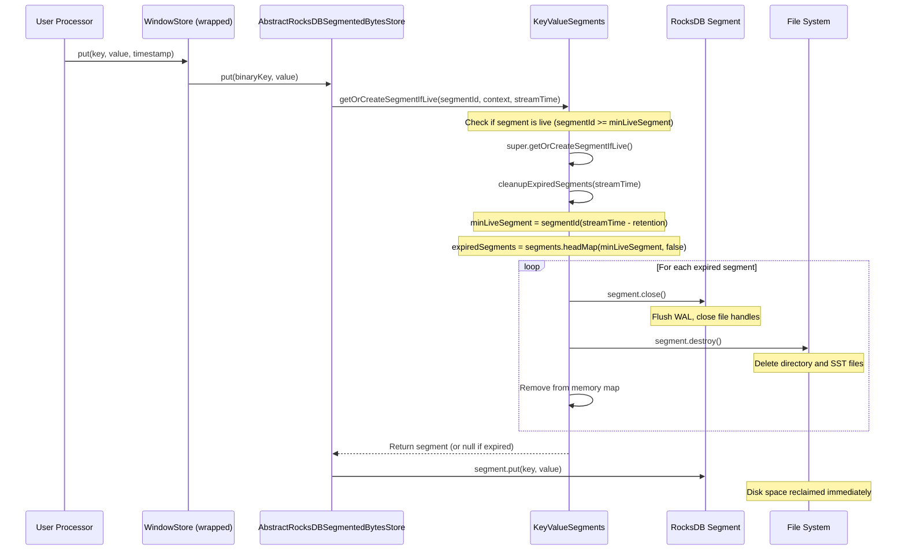

# Verification Report: Deduplication Window Store Design

> **Document Reviewed**: `deduplication-window-store-design.md`  
> **Verification Date**: 2026-01-19  
> **Focus Area**: Section 4.1 - Physical Cleanup Process (`cleanupExpiredSegments` caller)

---

## Executive Summary

The design document's prose description of cleanup triggers is **accurate**, but the **sequence diagram in Section 4.1 has an incorrect caller**. The diagram shows "Kafka Streams App" as the direct caller of `cleanupExpiredSegments()`, which is misleading.

---

## Finding: Incorrect Caller in Physical Cleanup Process Diagram

### Issue Location

**Section 4.1, lines 275-299** - "Physical Cleanup Process" sequence diagram:

```mermaid
sequenceDiagram
    participant App as Kafka Streams App   <-- MISLEADING
    ...
    App->>Seg: cleanupExpiredSegments(streamTime)   <-- INCORRECT
```

### Actual Call Chain (Verified from Kafka 3.5 Source)

| Layer | Class | Method | Role |
|-------|-------|--------|------|
| 1 | User Processor | `process(record)` | Entry point (user code) |
| 2 | WindowStore (wrapped) | `put(key, value, timestamp)` | User calls store API |
| 3 | `AbstractRocksDBSegmentedBytesStore` | `put(key, value)` | Internal store implementation |
| 4 | **`KeyValueSegments`** | `getOrCreateSegmentIfLive()` | **ACTUAL CALLER of cleanup** |
| 5 | `AbstractSegments` | `cleanupExpiredSegments()` | Cleanup logic execution |

### Source Code Evidence

#### 1. `AbstractRocksDBSegmentedBytesStore.put()` calls segments

```java
// Source: AbstractRocksDBSegmentedBytesStore.java
public void put(final Bytes key, final byte[] value) {
    final long timestamp = keySchema.segmentTimestamp(key);
    observedStreamTime = Math.max(observedStreamTime, timestamp);
    final long segmentId = segments.segmentId(timestamp);
    final S segment = segments.getOrCreateSegmentIfLive(segmentId, context, observedStreamTime);
    if (segment == null) {
        expiredRecordSensor.record(1.0d, context.currentSystemTimeMs());
        LOG.warn("Skipping record for expired segment.");
    } else {
        StoreQueryUtils.updatePosition(position, stateStoreContext);
        segment.put(key, value);
    }
}
```

#### 2. `KeyValueSegments.getOrCreateSegmentIfLive()` - THE ACTUAL CALLER

```java
// Source: KeyValueSegments.java
@Override
public KeyValueSegment getOrCreateSegmentIfLive(final long segmentId,
                                                final ProcessorContext context,
                                                final long streamTime) {
    final KeyValueSegment segment = super.getOrCreateSegmentIfLive(segmentId, context, streamTime);
    cleanupExpiredSegments(streamTime);  // <-- THIS IS THE ACTUAL CALLER
    return segment;
}
```

#### 3. `AbstractSegments.cleanupExpiredSegments()` - The cleanup logic

```java
// Source: AbstractSegments.java
protected void cleanupExpiredSegments(final long streamTime) {
    final long minLiveSegment = segmentId(streamTime - retentionPeriod);
    final Iterator<Map.Entry<Long, S>> toRemove =
        segments.headMap(minLiveSegment, false).entrySet().iterator();

    while (toRemove.hasNext()) {
        final Map.Entry<Long, S> next = toRemove.next();
        toRemove.remove();
        final S segment = next.getValue();
        segment.close();
        try {
            segment.destroy();
        } catch (final IOException e) {
            log.error("Error destroying {}", segment, e);
        }
    }
}
```

#### 4. `AbstractSegments.openExisting()` - Initialization path

```java
// Source: AbstractSegments.java
@Override
public void openExisting(final ProcessorContext context, final long streamTime) {
    // ... open existing segments ...
    cleanupExpiredSegments(streamTime);  // Also called here
}
```

---

## Verification Summary

| Aspect | Document Claim | Actual Behavior | Status |
|--------|----------------|-----------------|--------|
| Cleanup on every `put()` | Yes | Yes (via `getOrCreateSegmentIfLive`) | **Correct** |
| Cleanup on `openExisting()` | Yes | Yes | **Correct** |
| Cleanup on rebalance | Yes | Yes (triggers `openExisting`) | **Correct** |
| Caller in diagram | "Kafka Streams App" | `KeyValueSegments.getOrCreateSegmentIfLive()` | **INCORRECT** |
| Cleanup is unconditional | Yes | Yes (after every segment access) | **Correct** |

---

## Recommended Fix

Replace the current "Physical Cleanup Process" diagram with:



---

## Additional Observations

### 1. Cleanup is NOT triggered on `fetch()` operations

The document's state diagram note says:
> "CRITICAL: Cleanup is UNCONDITIONAL - Called after EVERY getOrCreateSegmentIfLive()"

This is accurate, but it's worth noting that `fetch()` operations do **NOT** trigger cleanup because they use `segments.segments()` or `getSegmentForTimestamp()`, not `getOrCreateSegmentIfLive()`.

| Operation | Triggers Cleanup? | Method Used |
|-----------|-------------------|-------------|
| `put()` | **Yes** | `getOrCreateSegmentIfLive()` |
| `fetch()` | No | `segmentsToSearch()` / `segments()` |
| `get()` | No | `getSegmentForTimestamp()` |
| `openExisting()` | **Yes** | Direct call to `cleanupExpiredSegments()` |
| `restoreAllInternal()` | **Yes** | `getOrCreateSegmentIfLive()` |

### 2. The "On rebalance" trigger is implicit

The document lists:
> 3. **On rebalance**: Task startup triggers cleanup

This is correct but could be clarified: rebalance -> task assignment -> `init()` -> `openExisting()` -> `cleanupExpiredSegments()`. It's not a separate trigger but a consequence of initialization.

---

## Source References

| Component | Source File (Kafka 3.5) |
|-----------|-------------------------|
| Segment cleanup logic | [AbstractSegments.java](https://github.com/apache/kafka/blob/3.5/streams/src/main/java/org/apache/kafka/streams/state/internals/AbstractSegments.java) |
| Cleanup caller | [KeyValueSegments.java](https://github.com/apache/kafka/blob/3.5/streams/src/main/java/org/apache/kafka/streams/state/internals/KeyValueSegments.java) |
| Store put() path | [AbstractRocksDBSegmentedBytesStore.java](https://github.com/apache/kafka/blob/3.5/streams/src/main/java/org/apache/kafka/streams/state/internals/AbstractRocksDBSegmentedBytesStore.java) |

---

## Conclusion

The design document is **fundamentally sound** in its understanding of Kafka Streams cleanup mechanics. The only correction needed is the **sequence diagram participant labeling** to accurately reflect that `KeyValueSegments.getOrCreateSegmentIfLive()` is the actual caller of `cleanupExpiredSegments()`, not "Kafka Streams App" directly.
