# Kafka Streams Window Store Deduplication: Architecture Design

> [!NOTE]
> **Target Version**: Apache Kafka Streams 3.5.x  
> **Document Status**: Production-Ready  
> **Last Updated**: 2026-01-15

---

## 1. Executive Summary

This document provides the architectural blueprint for implementing message deduplication using Kafka Streams' window store with RocksDB storage. The solution addresses critical production concerns including TTL mechanisms, segment sizing, cleanup strategies, exactly-once semantics, and performance optimization.

### 1.1 Key Parameters

| Parameter | Value | Rationale |
|-----------|-------|-----------|
| **Throughput** | 1,000 TPS | Business requirement |
| **Retention Period** | 100 days | Deduplication window |
| **Segment Interval** | 50 days | Retention / 2 (optimal balance) |
| **Duplicate Rate** | 0.001% | 99.999% unique messages |
| **Store Type** | Base Window Store | Minimal overhead for key-based queries |

### 1.2 Storage Summary

| Component | Size |
|-----------|------|
| Per-Segment Storage | ~471 GB |
| Window Store Total (2 segments) | ~942 GB |
| Changelog Topic | ~316 GB |
| **Total System Storage** | **~1.26 TB** |
| Hardware Requirement | 1.5+ TB NVMe |

### 1.3 Key Decisions

| Decision | Choice | Section |
|----------|--------|---------|
| Store Type | Base Window Store | [§2.1](#21-store-type-selection) |
| Segment Size | 50 days (retention/2) | [§2.2](#22-segment-size-justification) |
| Value Format | 8-byte timestamp | [§3.1](#31-entry-format) |
| Recovery Strategy | Standby replicas (n=2) | [§5.2](#52-standby-replica-configuration) |
| Compaction Strategy | Universal | [§5.3](#53-rocksdb-tuning) |

---

## 2. Architecture Decisions

### 2.1 Store Type Selection

> [!IMPORTANT]
> **Decision**: Use **Base Window Store** (`RocksDBSegmentedBytesStore`) for deduplication workloads.

#### Problem Statement

Kafka Streams provides multiple window store implementations. We must select the optimal type for deduplication.

#### Analysis

For deduplication, the query pattern is a **key-based point query**:
- "Does this specific key exist in this time range?"
- This is **not** time-ordered iteration

| Store Type | Storage | Write Amplification | Key Lookup | Recommendation |
|------------|---------|---------------------|------------|----------------|
| **Base Window Store** | 1.0× | 1× | O(log N) × segments | ✅ **Selected** |
| Time-Ordered Window Store | 1.36× | ~2× | O(log N) × segments | ❌ Unnecessary overhead |
| Timestamped Window Store | 1.1× | 1× | O(log N) × segments | ❌ Not needed |

#### Decision Rationale

Both Base and Time-Ordered stores have **identical complexity for key-based lookups** because:
1. Both use RocksDB's B-tree index for key lookups
2. The Time-Ordered store's secondary index organizes entries **by timestamp**, not by key
3. For a specific key lookup, you still traverse the primary key index

**Result**: Base Window Store saves 36% storage with no performance penalty for deduplication.

#### Store Type Decision Tree

```mermaid
graph TB
    A[DSL Operation] --> B{Store Type Required}
    
    B -->|Deduplication| C["Base Window Store<br/>✅ SELECTED"]
    B -->|Time-Ordered Queries| D["Time-Ordered Window Store"]
    B -->|Session Windows| E["Timestamped Window Store"]
    
    C --> F["Storage: 1.0×<br/>Query: O(log N) × 2 segments<br/>Write Amp: 1×"]
    D --> G["Storage: 1.36×<br/>Query: O(log N) × 2 segments<br/>Write Amp: 2×"]
    E --> H["Storage: 1.1×<br/>Query: O(log N) × 2 segments<br/>Write Amp: 1×"]
    
    style C fill:#C8E6C9,stroke:#388E3C,stroke-width:2px,color:#000
```



---

### 2.2 Segment Size Justification

> [!IMPORTANT]
> **Decision**: Use `segmentInterval = retention / 2` (50 days for 100-day retention).

#### The Formula

```
segmentInterval = max(retentionPeriod / 2, 60 seconds)
```

This is a well-established Kafka Streams convention providing the optimal balance between:
- Query efficiency (fewer segments to scan)
- Cleanup granularity (meaningful disk reclamation)
- Operational simplicity (predictable behavior)

#### Segment Lifecycle

With 50-day segments and 100-day retention:

| Stream Time | Segment 0 (0-50d) | Segment 1 (50-100d) | Segment 2 (100-150d) |
|-------------|-------------------|---------------------|----------------------|
| Day 25 | ✅ Active | ❌ Not created | ❌ Not created |
| Day 75 | ✅ Active | ✅ Active | ❌ Not created |
| Day 125 | ❌ Expired & deleted | ✅ Active | ✅ Active |

#### Trade-off Analysis

| Segment Size | # Segments | Cleanup Frequency | Query Overhead | Verdict |
|--------------|------------|-------------------|----------------|---------|
| 10 days | 10 | Every 10 days | High (10 scans) | ❌ Too many |
| 25 days | 4 | Every 25 days | Medium (4 scans) | ⚠️ Alternative |
| **50 days** | **2** | **Every 50 days** | **Low (2 scans)** | ✅ **Selected** |
| 100 days | 1 | Every 100 days | Lowest (1 scan) | ❌ No incremental cleanup |

#### Why Not Single Segment (100 days)?

- **No incremental cleanup**: Unbounded storage growth until first cleanup
- **All-or-nothing failure**: Single segment corruption loses everything

#### Why Not Many Segments (10 days)?

- **Higher query overhead**: Each `fetch()` scans 10 RocksDB instances
- **More file handles**: Each segment is a separate RocksDB with its own SST files
- **Resource fragmentation**: Bloom filters, compaction threads multiplied

---

## 3. Data Model

### 3.1 Entry Format

Each deduplication entry stores the key and timestamp of last occurrence:

| Component | Size | Description |
|-----------|------|-------------|
| **Dedup Key** | 64 bytes | Max key length (64 chars) |
| **Value** | 8 bytes | Timestamp of last occurrence (long) |
| **Metadata** | 12 bytes | Timestamp (8) + SeqNum (4) |
| **Raw Entry** | **84 bytes** | Sum of above |
| **Effective Entry** | **~109 bytes** | With RocksDB overhead (×1.3) |

### 3.2 Segment Organization

```
/state.dir/
└── application.id/
    └── dedup-window-store/
        ├── dedup-window-store.0           # Segment 0 (days 0-50)
        │   ├── CURRENT
        │   ├── IDENTITY
        │   ├── LOCK
        │   ├── LOG
        │   ├── MANIFEST-*
        │   └── *.sst                      # RocksDB data files
        └── dedup-window-store.4320000000000  # Segment 1 (days 50-100)
            └── ...
```

**Segment Directory Naming**: `storeName.timestamp` where timestamp = segmentId × segmentInterval

#### Segment Directory Structure Diagram


### 3.3 Storage Sizing

#### Volume Calculation

| Parameter | Value | Calculation |
|-----------|-------|-------------|
| Throughput | 1,000 TPS | Given |
| Segment duration | 50 days | 4,320,000 seconds |
| Records per segment | 4.32 billion | 1,000 × 4,320,000 |
| Duplicate rate | 0.001% | Very low |
| **Stored records per segment** | **~4.32 billion** | 99.999% stored |

#### Storage Estimates

| Component | Calculation | Size |
|-----------|-------------|------|
| Per-segment storage | 4.32B × 109 bytes | **~471 GB** |
| Window store total (2 segments) | 471 × 2 | **~942 GB** |
| Changelog topic | 942 × 1.3 overhead | **~316 GB** |
| **Total system storage** | | **~1.26 TB** |

> [!WARNING]
> **Hardware Requirement**: 1.5+ TB NVMe storage with standby replicas for fast recovery.

---

## 4. TTL and Cleanup Mechanism

### 4.1 Cleanup Triggers

> [!IMPORTANT]
> **Source Reference**: [KeyValueSegments.java](https://github.com/apache/kafka/blob/3.5/streams/src/main/java/org/apache/kafka/streams/state/internals/KeyValueSegments.java#L56-L63)

Kafka Streams performs **proactive cleanup** on every segment access:

1. **On every `put()` operation**: `getOrCreateSegmentIfLive()` calls `cleanupExpiredSegments()`
2. **On store initialization**: `openExisting()` calls `cleanupExpiredSegments()`
3. **On rebalance**: Task startup triggers cleanup

#### Cleanup Trigger State Diagram


#### Cleanup Calculation

```
minLiveTimestamp = observedStreamTime - retentionPeriod
minLiveSegment = segmentId(minLiveTimestamp)
expiredSegments = all segments where segmentId < minLiveSegment
```

#### Physical Cleanup Process


### 4.2 Cleanup Timing

For 1,000 TPS with 100-day retention (50-day segments):

| Metric | Value |
|--------|-------|
| Segment advancement rate | Every ~4.32 billion records |
| Cleanup frequency | Every 50 days (on average) |
| Cleanup volume | ~471 GB (1 segment) |
| Time to reclaim disk | Immediate (segment deleted) |

### 4.3 Changelog Retention

Window store cleanup and changelog cleanup are **independent processes**:

| Aspect | Window Store | Changelog Topic |
|--------|--------------|-----------------|
| Cleanup trigger | Application code | Kafka broker |
| Cleanup unit | Entire segment | Individual records |
| Timing | Immediate | Hours/days later |

**Configuration**:
```properties
# Changelog retention = store retention + additional buffer
windowstore.changelog.additional.retention.ms=86400000  # 24 hours
```

> [!NOTE]
> **For Deduplication**: Replaying expired data doesn't break functionality—the application makes the actual deduplication decision. Configure changelog retention for performance, not data correctness.

---

## 5. Performance and Operations

### 5.1 Query Performance

> [!IMPORTANT]
> **Source Reference**: [AbstractRocksDBSegmentedBytesStore.java](https://github.com/apache/kafka/blob/3.5/streams/src/main/java/org/apache/kafka/streams/state/internals/AbstractRocksDBSegmentedBytesStore.java#L93-L115)

#### Read Path Overview

1. `fetch(key, timeFrom, timeTo)` called
2. Clamp `timeFrom` to retention boundary
3. Find segments overlapping query range
4. Execute RocksDB range scan per segment
5. Return merged iterator

**Complexity**: O(log N) per segment × number of segments (typically 2)

#### Read Path Sequence Diagram


**Key Observations**:
- **Retention Enforcement on Read**: The `actualFrom` calculation ensures expired data is never returned
- **Multi-Segment Scan**: A single `fetch()` may scan multiple segments if time range spans boundaries
- **RocksDB Range Scan**: Within each segment, RocksDB performs efficient B-tree range scan

#### Bloom Filter Optimization

For deduplication with 0.001% duplicate rate:
- 99.999% of `fetch()` calls return "not found"
- Bloom filters serve these queries **without disk I/O**
- Only positive matches require disk reads

### 5.2 Standby Replica Configuration

> [!IMPORTANT]
> **Recommendation**: Set `num.standby.replicas=2` for production deployments.

#### Recovery Time Comparison

| Configuration | Recovery Time | Network Overhead |
|---------------|---------------|------------------|
| Standby = 0 | 1-4 hours (cold restore) | Baseline |
| **Standby = 2** | **< 30 seconds** | **+50% traffic** |

#### Trade-off Analysis

| Metric | Standby = 0 | Standby = 2 |
|--------|-------------|-------------|
| Recovery Time (RTO) | Hours | Seconds |
| Disk Usage | 1× | 3× |
| Network Bandwidth | Baseline | +50% |
| CPU Usage | Baseline | Higher |

**Verdict**: For ~1 TB store with 100-day retention, cold restore is too slow. Standby replicas are **required** for production SLAs.

### 5.3 RocksDB Tuning

#### Compaction Strategy Selection

| Strategy | Optimized For | Recommendation |
|----------|---------------|----------------|
| Level (Default) | Read-heavy | ❌ Risk of write stalls |
| **Universal** | **Write-heavy** | ✅ **Selected** |
| FIFO | Cache/Queue | ❌ Not suitable |

**Rationale**: With 99.999% unique messages, almost every `process()` call results in a `put()`. The workload is **write-heavy**. Universal compaction minimizes write amplification.

#### Key Configuration

| Parameter | Value | Purpose |
|-----------|-------|---------|
| `compaction_style` | UNIVERSAL | Minimize write overhead |
| `write_buffer_size` | 128 MB | Reduce flush frequency |
| `max_write_buffer_number` | 4 | Buffer bursts in memory |
| `bloom_filter_bits` | 10 | 1% false positive rate |
| `cache_index_and_filter_blocks` | true | Keep metadata in memory |

---

## 6. Exactly-Once Semantics

### 6.1 EOS Configuration

```properties
processing.guarantee=exactly_once_v2
```

### 6.2 State Store Registration

State stores are automatically registered via topology—no explicit `context.register()` call needed:

```java
// Topology wires store to processor
builder.addStateStore(storeBuilder);
builder.stream("input-topic")
       .process(DeduplicationProcessor::new, "dedup-window-store")
       .to("output-topic");
```

### 6.3 Failure Recovery

| Failure Scenario | Recovery Mechanism |
|------------------|-------------------|
| Application crash | Changelog replay |
| Segment corruption | Delete segment, replay from changelog |
| Disk full | Free space, restart application |
| Network partition | EOS prevents duplicates, auto-recovery |

---

## 7. Risk Assessment

### 7.1 Risk Matrix

| Risk | Probability | Impact | Priority |
|------|-------------|--------|----------|
| Disk Space Exhaustion | Medium-High | High | 🔴 **Critical** |
| Segment Corruption | High | Low | 🟠 High |
| Clock Skew | Medium | Medium | 🟡 Medium |
| Memory Pressure | Medium | Medium | 🟡 Medium |
| Changelog Cleanup | Medium-High | Low | 🟢 Low |

### 7.2 Mitigation Actions

| Risk | Mitigation |
|------|------------|
| **Disk Space Exhaustion** | Alert at 70% usage, auto-scaling policy |
| **Segment Corruption** | Enable RocksDB checksums, redundant storage |
| **Clock Skew** | NTP sync, increase additional retention buffer |
| **Memory Pressure** | Right-size JVM heap (4+ GB), tune RocksDB cache |
| **Changelog Cleanup** | Configure based on restore time, not data correctness |

---

## 8. Operations Runbook

### 8.1 Configuration Checklist

```properties
# Kafka Streams
application.id=deduplication-prod
processing.guarantee=exactly_once_v2
state.dir=/data/kafka-streams
num.standby.replicas=2

# RocksDB
rocksdb.config.setter.class=DeduplicationRocksDBConfigSetter

# Changelog
windowstore.changelog.additional.retention.ms=86400000
```

### 8.2 Monitoring Metrics

| Metric | Alert Threshold |
|--------|-----------------|
| `rocksdb.read-latency-avg` | > 100ms |
| `state.size` | > 80% disk capacity |
| `consumer.lag` | > 10,000 |
| Duplicate rate | > 0.01% (unexpected) |

### 8.3 Recovery Procedures

#### Segment Corruption

```bash
# 1. Stop application
# 2. Remove corrupted segment
rm -rf $STATE_DIR/dedup-window-store/dedup-window-store.<segment_id>
# 3. Restart application (will restore from changelog)
```

#### Disk Full

```bash
# 1. Free disk space
rm -rf $STATE_DIR/.*.tmp
# 2. Check segment sizes
du -sh $STATE_DIR/dedup-window-store/*
# 3. Restart with reduced load
```

---

## 9. Production Checklist

- [ ] **Storage**: 1.5+ TB NVMe provisioned
- [ ] **Memory**: 4+ GB JVM heap configured
- [ ] **Standby Replicas**: `num.standby.replicas=2` set
- [ ] **EOS**: `processing.guarantee=exactly_once_v2` enabled
- [ ] **Monitoring**: JMX metrics + alerting configured
- [ ] **Backup**: Automated daily backups with validation
- [ ] **Load Testing**: 2× throughput for 24+ hours completed
- [ ] **Failure Testing**: Network partition, disk full simulated

---

## Appendix A: Pseudo-Code Implementation

### A.1 Deduplication Processor

```pseudo
CLASS DeduplicationProcessor IMPLEMENTS Processor<String, String, String, String>:
    
    CONST STORE_NAME = "dedup-window-store"
    CONST RETENTION_PERIOD_MS = 100 * 24 * 60 * 60 * 1000  // 100 days
    
    FIELD context: ProcessorContext<String, String>
    FIELD windowStore: WindowStore<String, Long>
    
    FUNCTION init(context: ProcessorContext<String, String>):
        this.context = context
        this.windowStore = context.getStateStore(STORE_NAME)
    END FUNCTION
    
    FUNCTION process(record: Record<String, String>):
        dedupKey = extractDeduplicationKey(record.value())
        
        timeFrom = record.timestamp() - RETENTION_PERIOD_MS
        timeTo = record.timestamp()
        
        iterator = windowStore.fetch(dedupKey, timeFrom, timeTo)
        
        IF NOT iterator.hasNext():
            // First occurrence - store timestamp and forward
            windowStore.put(dedupKey, record.timestamp(), record.timestamp())
            context.forward(record)
        ELSE:
            // Duplicate detected - reject
            LOG.debug("Duplicate rejected: key={}", dedupKey)
        END IF
        
        iterator.close()
    END FUNCTION
    
    FUNCTION extractDeduplicationKey(value: String) -> String:
        // Options: message UUID, content hash, business key
        RETURN computeContentHash(value)
    END FUNCTION
    
    FUNCTION close():
        // State stores managed by framework - do NOT close here
    END FUNCTION
END CLASS
```

### A.2 Topology Builder

```pseudo
FUNCTION buildTopology():
    builder = new StreamsBuilder()
    
    storeBuilder = Stores.windowStoreBuilder(
        Stores.persistentWindowStore(
            "dedup-window-store",
            Duration.ofDays(100),     // retention period
            Duration.ofDays(50),      // segment interval
            false                     // retainDuplicates
        ),
        Serdes.String(),
        Serdes.Long()                 // Value is timestamp
    )
    
    builder.addStateStore(storeBuilder)
    
    builder.stream("input-topic")
           .process(DeduplicationProcessor::new, "dedup-window-store")
           .to("output-topic")
    
    RETURN builder.build()
END FUNCTION
```

### A.3 RocksDB Config Setter

```java
public class DeduplicationRocksDBConfigSetter implements RocksDBConfigSetter {

    @Override
    public void setConfig(String storeName, Options options, Map<String, Object> configs) {
        // Universal compaction for write-heavy workload
        options.setCompactionStyle(CompactionStyle.UNIVERSAL);
        
        // Write buffer configuration
        options.setWriteBufferSize(128 * 1024 * 1024L);  // 128MB
        options.setMaxWriteBufferNumber(4);
        
        // Compaction triggers
        options.setLevel0FileNumCompactionTrigger(4);
        options.setLevel0SlowdownWritesTrigger(20);
        options.setLevel0StopWritesTrigger(40);
        
        // Bloom filter for efficient negative lookups
        BlockBasedTableConfig tableConfig = new BlockBasedTableConfig();
        tableConfig.setFilterPolicy(new BloomFilter(10, false));
        tableConfig.setCacheIndexAndFilterBlocks(true);
        tableConfig.setPinL0FilterAndIndexBlocksInCache(true);
        options.setTableFormatConfig(tableConfig);
        
        // Parallelism
        options.setMaxBackgroundJobs(4);
        
        // Compression
        options.setCompressionType(CompressionType.LZ4_COMPRESSION);
    }

    @Override
    public void close(String storeName, Options options) {
        // No cleanup needed
    }
}
```

---

## Appendix B: Disk Usage Estimation Script

```bash
#!/bin/bash
# disk-estimate.sh - Calculate storage requirements for deduplication

RETENTION_DAYS=100
THROUGHPUT_TPS=1000
KEY_SIZE=64              # 64 chars max
VALUE_SIZE=8             # Timestamp (long)
METADATA_SIZE=12         # timestamp:8 + seqnum:4
ROCKSDB_OVERHEAD=1.3     # With LZ4 compression
CHANGELOG_OVERHEAD=1.3
SEGMENT_DAYS=50

# Calculations
SECONDS_PER_DAY=86400
RAW_ENTRY=$((KEY_SIZE + VALUE_SIZE + METADATA_SIZE))  # 84 bytes
EFFECTIVE_ENTRY=$(echo "$RAW_ENTRY * $ROCKSDB_OVERHEAD" | bc)  # ~109 bytes

MESSAGES_PER_SEGMENT=$((THROUGHPUT_TPS * SECONDS_PER_DAY * SEGMENT_DAYS))
SEGMENT_GB=$(echo "scale=0; $MESSAGES_PER_SEGMENT * $EFFECTIVE_ENTRY / 1024 / 1024 / 1024" | bc)

TOTAL_MESSAGES=$((THROUGHPUT_TPS * SECONDS_PER_DAY * RETENTION_DAYS))
CHANGELOG_GB=$(echo "scale=0; $TOTAL_MESSAGES * $RAW_ENTRY * $CHANGELOG_OVERHEAD / 1024 / 1024 / 1024" | bc)

echo "=== Deduplication Storage Estimate ==="
echo "Configuration: ${THROUGHPUT_TPS} TPS, ${RETENTION_DAYS}-day retention"
echo ""
echo "Per-Entry:     ${RAW_ENTRY} bytes raw, ~109 bytes effective"
echo "Per-Segment:   ~${SEGMENT_GB} GB"
echo "Window Store:  ~$((SEGMENT_GB * 2)) GB (2 segments)"
echo "Changelog:     ~${CHANGELOG_GB} GB"
echo "Total:         ~$((SEGMENT_GB * 2 + CHANGELOG_GB)) GB"
echo ""
echo "Recommendation: 1.5+ TB NVMe with standby replicas"
```

---

## Appendix C: Source References

| Component | Source File |
|-----------|-------------|
| Segment Organization | [AbstractSegments.java](https://github.com/apache/kafka/blob/3.5/streams/src/main/java/org/apache/kafka/streams/state/internals/AbstractSegments.java) |
| Cleanup Logic | [KeyValueSegments.java](https://github.com/apache/kafka/blob/3.5/streams/src/main/java/org/apache/kafka/streams/state/internals/KeyValueSegments.java) |
| Read Path | [AbstractRocksDBSegmentedBytesStore.java](https://github.com/apache/kafka/blob/3.5/streams/src/main/java/org/apache/kafka/streams/state/internals/AbstractRocksDBSegmentedBytesStore.java) |
| Processor API | [Processor.java](https://github.com/apache/kafka/blob/3.5/streams/src/main/java/org/apache/kafka/streams/processor/api/Processor.java) |
| EOS Config | [StreamsConfig.java](https://github.com/apache/kafka/blob/3.5/streams/src/main/java/org/apache/kafka/streams/StreamsConfig.java) |
