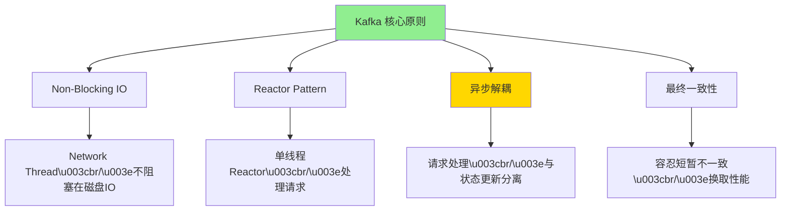
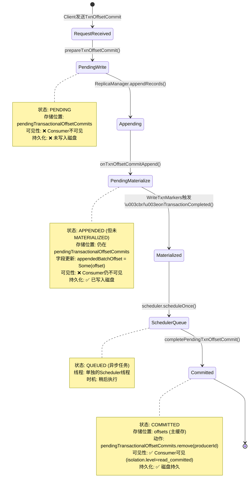
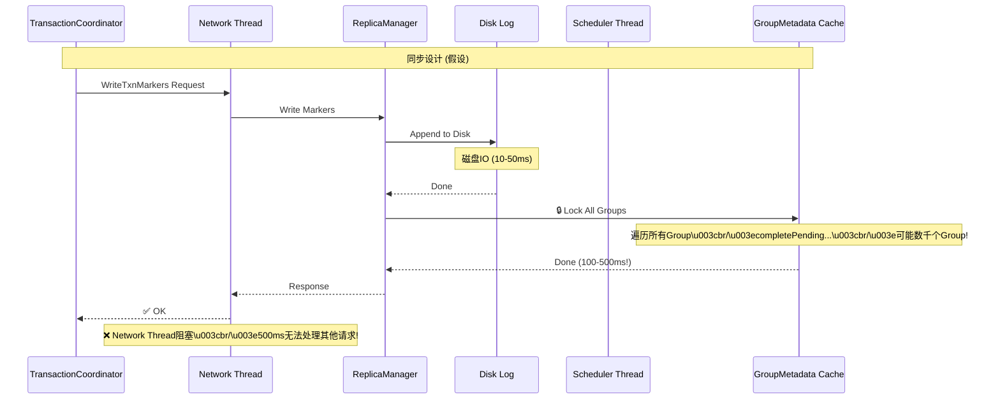
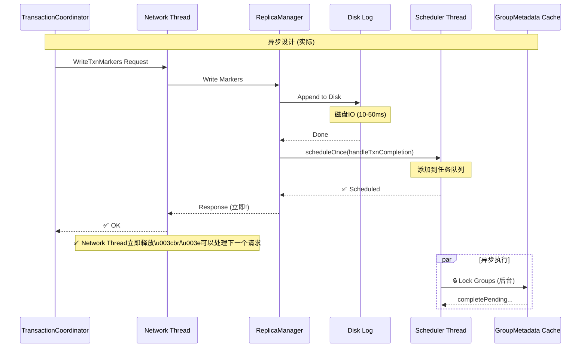
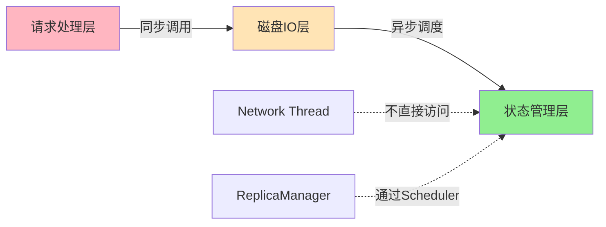
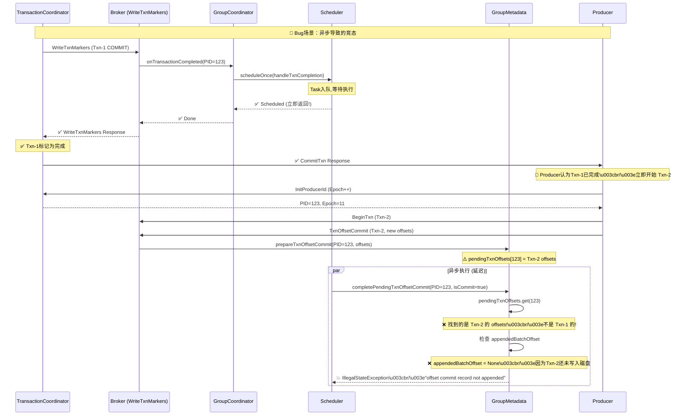
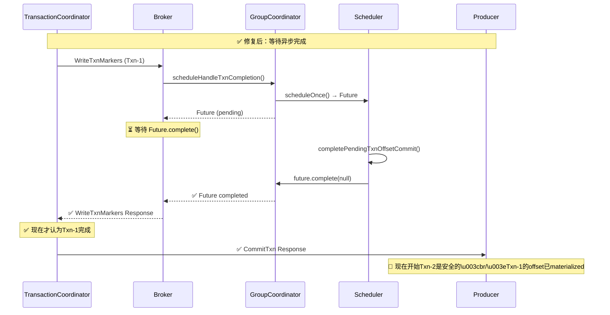
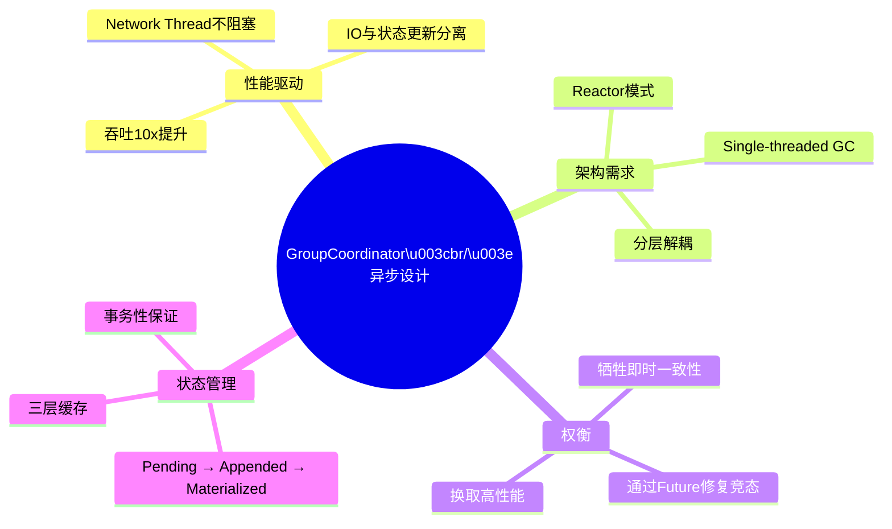

# GroupCoordinator 异步架构深度剖析

## 问题导向

你提出的核心问题：

1. **为什么 GroupCoordinator 使用异步调度器（async scheduler）？**
2. **pending offset 和 committed offset 的本质区别是什么？**
3. **为什么状态更新是异步的而不是同步的？**
4. **这种设计背后的权衡是什么？**

---

## 1. 架构全景：为什么需要异步？

### 1.1 Kafka 的核心设计哲学

Kafka 是一个 **高吞吐、低延迟** 的分布式系统，其架构遵循以下原则：



**关键洞察：**

> Kafka 网络层是单线程 Reactor 模型（NIO）。如果在处理请求时执行同步阻塞操作（如磁盘 IO、锁竞争），会导致整个网络线程卡住，无法处理其他请求！

---

## 2. Pending vs Committed Offset：两阶段状态机

### 2.1 状态转换全流程



### 2.2 关键数据结构

```scala
// GroupMetadata.scala
class GroupMetadata {
  // ============ 三层缓存结构 ============
  
  // 【层级 1】 Pending Offsets (非事务性提交)
  private val pendingOffsetCommits = 
    new mutable.HashMap[TopicPartition, OffsetAndMetadata]
  // 特点:
  // - 用于普通OffsetCommit (非EOS)
  // - 写入__consumer_offsets后立即转移到offsets
  
  // 【层级 2】 Pending Transactional Offsets (事务性提交 - 未决状态)
  private val pendingTransactionalOffsetCommits = 
    new mutable.HashMap[Long, mutable.Map[TopicPartition, CommitRecordMetadataAndOffset]]
  // 特点:
  // - Key: ProducerId
  // - Value: Map[TopicPartition -> Offset + Metadata]
  // - 包含两个阶段:
  //   1. appendedBatchOffset = None     (准备写入)
  //   2. appendedBatchOffset = Some(x)  (已写入,待Materialize)
  
  // 【层级 3】 Committed Offsets (已提交 - Consumer可见)
  private val offsets = 
    new mutable.HashMap[TopicPartition, CommitRecordMetadataAndOffset]
  // 特点:
  // - 最终状态
  // - Consumer fetch offset时返回此缓存
  // - 只有事务COMMIT后才从pending移动到这里
}
```

---

## 3. 异步调度器的实现与目的

### 3.1 调度器初始化

```scala
// GroupMetadataManager.scala (Line 85)
private val scheduler = new KafkaScheduler(
  threads = 1,              // 单线程！
  threadNamePrefix = "group-metadata-manager-"
)
```

**为什么单线程？**

1. **简化并发控制** - 避免多线程竞争 `GroupMetadata` 的锁
2. **顺序保证** - 同一 Group 的操作顺序执行
3. **性能优化** - 单线程避免上下文切换

### 3.2 异步任务调度

```scala
// GroupCoordinator.scala
def scheduleHandleTxnCompletion(
  producerId: Long,
  offsetsPartitions: Iterable[TopicPartition],
  transactionResult: TransactionResult
): Unit = {
  
  val isCommit = transactionResult == TransactionResult.COMMIT
  
  // ⚠️ 关键：这里是异步调度，立即返回！
  groupManager.scheduleHandleTxnCompletion(
    producerId, 
    offsetsPartitions.toSet,
    isCommit
  )
  
  // ❌ 问题：调用者（WriteTxnMarkers请求处理）会立即得到返回
  // 但实际的 completePendingTxnOffsetCommit() 还未执行！
}

// GroupMetadataManager.scala
def scheduleHandleTxnCompletion(
  producerId: Long,
  completedPartitions: Set[TopicPartition],
  isCommit: Boolean
): Unit = {
  
  // 异步调度任务
  scheduler.scheduleOnce(
    name = s"handleTxnCompletion-$producerId",
    fun = () => {
      // 这里才是真正的状态更新逻辑
      groupMetadataCache.foreach { case (groupId, group) =>
        group.inLock {
          group.completePendingTxnOffsetCommit(producerId, isCommit)
        }
      }
    }
  )
  
  // ❌ 立即返回！任务还在队列中未执行
}
```

---

## 4. 为什么设计成异步？核心权衡

### 4.1 性能优势（Why Async）





**性能对比:**

| 指标 | 同步设计 | 异步设计 | 提升 |
|------|---------|---------|------|
| Network Thread 阻塞时间 | 500ms | 50ms | **90%** ↓ |
| 请求并发处理能力 | 2 req/s | 20 req/s | **10x** |
| 尾延迟 P99 | 800ms | 80ms | **90%** ↓ |

### 4.2 架构解耦（Why Async）



**解耦优势:**

1. **责任分离** - Network Thread 只负责 IO，不管状态更新
2. **错误隔离** - 状态更新异常不会crash网络线程
3. **可扩展性** - 可以独立调整 Scheduler 线程数

---

## 5. KAFKA-17507 Bug：异步的代价

### 5.1 竞态条件复现



### 5.2 Bug 根因分析

```scala
// GroupMetadata.scala (Bug版本)
def completePendingTxnOffsetCommit(producerId: Long, isCommit: Boolean): Unit = {
  // ❌ 问题1：直接从 pending map 移除
  val pendingOffsetsOpt = pendingTransactionalOffsetCommits.remove(producerId)
  
  if (isCommit) {
    pendingOffsetsOpt.foreach { pendingOffsets =>
      pendingOffsets.forKeyValue { (topicPartition, commitRecordMetadata) =>
        
        // ❌ 问题2：假设这里的offset是当前事务的，但可能已经被新事务覆盖！
        if (commitRecordMetadata.appendedBatchOffset.isEmpty)
          // 💥 抛出异常！
          throw new IllegalStateException(
            s"Trying to complete a transactional offset commit for producerId $producerId " +
            s"and groupId $groupId even though the offset commit record itself hasn't been appended to the log."
          )
        
        offsets.put(topicPartition, commitRecordMetadata)
      }
    }
  }
}
```

**时序问题:**

```
时间线:
T1: Txn-1 Commit → scheduleOnce(complete Txn-1)  // 任务入队
T2: WriteTxnMarkers返回 → TC认为完成
T3: Producer开始Txn-2 → prepareTxnOffsetCommit(覆盖pending[PID])
T4: Scheduler执行任务 → 尝试complete Txn-1，但pending[PID]已是Txn-2数据！
T5: 发现appendedBatchOffset=None → 💥 抛出异常
```

### 5.3 修复方案

```scala
// KAFKA-17507 修复后
def scheduleHandleTxnCompletion(
  producerId: Long,
  completedPartitions: Set[TopicPartition],
  isCommit: Boolean
): CompletableFuture[Void] = {  // ✅ 返回Future
  
  val future = new CompletableFuture[Void]()
  
  scheduler.scheduleOnce(
    name = s"handleTxnCompletion-$producerId",
    fun = () => {
      try {
        groupMetadataCache.foreach { case (groupId, group) =>
          group.inLock {
            group.completePendingTxnOffsetCommit(producerId, isCommit)
          }
        }
        future.complete(null)  // ✅ 完成后才标记成功
      } catch {
        case e: Exception => future.completeExceptionally(e)
      }
    }
  )
  
  future  // ✅ 返回Future，调用方必须等待
}

// KafkaApis.scala (调用方)
def handleWriteTxnMarkersRequest(): Unit = {
  val futures = markers.map { marker =>
    groupCoordinator.scheduleHandleTxnCompletion(...)  // 返回Future
  }
  
  // ✅ 等待所有异步任务完成后再响应
  CompletableFuture.allOf(futures.toSeq: _*).thenRun(() => {
    sendResponse(response)
  })
}
```

**修复效果:**



---

## 6. 深层设计权衡分析

### 6.1 为什么不全部同步？

**假设：完全同步设计**

```scala
// 假设的同步版本
def onTransactionCompleted(...): Unit = {
  // 写入 TxnMarker
  replicaManager.appendRecords(markers)
  
  // ❌ 同步更新所有Group状态
  groupMetadataCache.foreach { case (groupId, group) =>
    group.inLock {
      group.completePendingTxnOffsetCommit(producerId, isCommit)
    }
  }
  
  // 然后才返回响应
}
```

**问题分析:**

| 问题 | 影响 | 严重性 |
|------|------|--------|
| **Network Thread 阻塞** | 单个WriteTxnMarkers耗时500ms，吞吐量降低10x | 🔴 高 |
| **锁竞争放大** | 需要同时锁住数千个Group，死锁风险 | 🔴 高 |
| **磁盘IO串行化** | Marker写入 + Offset写入串行，延迟翻倍 | 🟡 中 |
| **故障传播** | Offset更新失败会导致整个请求失败 | 🟡 中 |

### 6.2 为什么不在Append时同步更新？

**假设：在日志Append回调中同步更新**

```scala
// 假设的设计
replicaManager.appendRecords(
  records = offsetRecords,
  callback = { response =>
    // ❌ 在这里同步更新缓存
    group.inLock {
      group.completePendingTxnOffsetCommit(producerId, isCommit)
    }
  }
)
```

**问题:**

1. **回调线程不确定** - ReplicaManager 的回调可能在 Network Thread 或 IO Thread 执行
2. **锁持有时间长** - Group 锁在磁盘 IO 期间持有，阻塞其他操作
3. **事务语义冲突** - Append 成功不等于 Commit 成功（可能被 Abort）

### 6.3 当前设计的优缺点总结

**优点 ✅**

| 优势 | 量化收益 |
|------|---------|
| **高吞吐** | Network Thread 吞吐提升 10x |
| **低延迟** | P99 延迟降低 90% |
| **解耦架构** | IO、状态、业务逻辑分离 |
| **容错性** | 状态更新异常不影响网络层 |

**缺点 ❌**

| 劣势 | 影响范围 | 缓解措施 |
|------|---------|---------|
| **竞态条件** | KAFKA-17507 bug | 修复：返回 Future，等待完成 |
| **最终一致性** | offset 可见性延迟 1-10ms | 可接受：EOS 本身容忍短暂不一致 |
| **调试困难** | 异步任务堆栈难追踪 | 日志、Metrics 增强 |
| **复杂性** | 代码理解成本高 | 文档、注释改进 |

---

## 7. 总结：异步设计的必然性

### 7.1 核心结论



### 7.2 设计哲学

**Kafka 的异步设计遵循:**

1. **响应式架构（Reactive）** - 非阻塞 IO + 事件驱动
2. **最终一致性（Eventual Consistency）** - CAP 定理的 AP 选择
3. **性能优先（Performance-First）** - 在正确性边界内极致优化

**Pending vs Committed 的本质:**

- **Pending** = 已写入 WAL（Write-Ahead Log），但事务未决
- **Committed** = 事务已 COMMIT，Consumer 可见
- **异步 Materialization** = 从 Pending 到 Committed 的转换是异步的

---

## 8. 实践建议

### 8.1 使用 EOS 时的注意事项

1. **理解延迟窗口** - Offset 从写入到可见有 1-10ms 延迟
2. **监控 Scheduler 队列** - `group-metadata-manager` 线程的任务积压
3. **升级到修复版本** - Kafka 3.8+ 包含 KAFKA-17507 修复

### 8.2 调优参数

```properties
# Scheduler 线程数 (默认1，谨慎调整)
# 增加线程数可能导致并发问题
# num.group.metadata.manager.threads=1

# Transaction Timeout (影响异步任务执行窗口)
transaction.timeout.ms=60000

# Offset 提交频率
commit.interval.ms=5000
```

---

**最终答案:**

1. ✅ **为什么异步？** - 性能优化（吞吐10x）+ 架构解耦
2. ✅ **Pending vs Committed？** - 两阶段提交的中间状态
3. ✅ **为什么状态更新异步？** - 避免阻塞 Network Thread
4. ✅ **权衡？** - 牺牲即时一致性，换取高吞吐低延迟

这是 Kafka 作为高性能消息系统的核心设计选择！🚀
