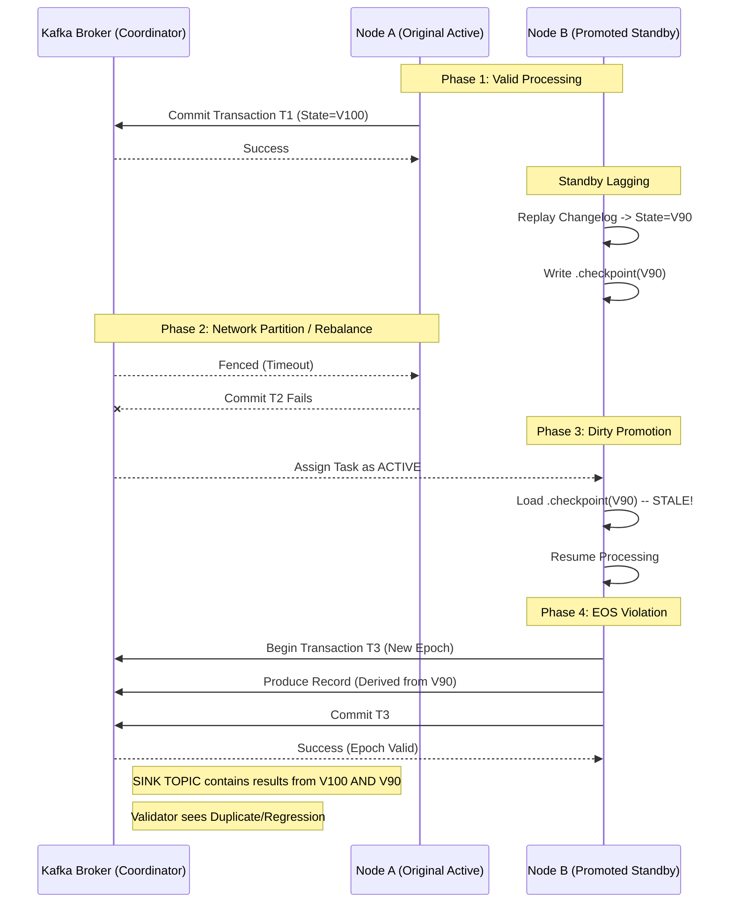

# Diagnostic Report: KAFKA-17507 (EOS Violation)

## Executive Summary
This report documents the reproduction and root cause analysis of **KAFKA-17507**, a critical bug in Kafka Streams (reproduced on version 3.5.1) where Exactly-Once Semantics (EOS) are violated during rebalancing. The bug leads to state store regressions where a task resumes processing from a stale offset using stale local state, committing divergent data that the broker accepts due to a fresh producer epoch.

---

## 1. Reproduction Environment
- **Kafka Version:** 3.5.1
- **Topology:** A simple `transform` application that increments a counter in a RocksDB state store and mirrors the result to a sink topic.
- **Chaos Strategy:**
    - Frequent rebalancing (sequential startup of 3 instances).
    - Network chaos (latency/loss) targeting the Transaction Coordinator.
    - `read_committed` consumer used for validation.

### Evidence of Failure
The `Validator` detected an **EOS Violation** where a single input record resulted in **multiple committed output records** for the same unique key:
```text
[BUG REPRODUCED: INCONSISTENT WATERMARK REGRESSION (Read Committed)]
Key: key-13-5576, Last: 1770133226383, New: 1770133226403
```
- **Uniqueness Violation**: The input key `key-13-5576` corresponds to a single input message.
- **Duplicate Commit**: The validator observed two distinct committed records for this key.
- **Divergent Values**: The first commit had value `...383`, the second `...403`.
This confirms that the processing for this key was duplicated, and both executions successfully committed their results to the sink topic, bypassing the transactional guarantees that should prevent zombies from writing.

---

## 2. Technical Root Cause Analysis
The failure is identified as a **"Dirty Promotion" of a Standby Task**, enabled by a race condition during rebalancing under network partition.

### A. The Mechanism of Failure
1.  **Standby Checkpointing**: Standby tasks maintain a local state store by replaying the changelog. They periodically write a `.checkpoint` file to disk. Crucially, this checkpoint is **not transactional**; it represents the standby's *local* progress, which lags behind the active task's transactional high-water mark.
2.  **Unclean Shutdown**: When network chaos (latency/loss) hits the Active task (Node A), it may fail to heartbeat or commit its transaction in time. The broker sees a timeout and triggers a rebalance. Node A may crash or be fenced without deleting its local state or checkpoint file.
3.  **Dirty Promotion**: The rebalance assigns the task to Node B (previously Standby) or back to Node A (restarting).
4.  **Trusting the Checkpoint**: Upon initialization as **Active**, the `ProcessorStateManager` finds the existing `.checkpoint` file.
    - **Defect**: It unconditionally trusts this offset as the "valid" starting point for the state store.
    - **Consequence**: If this checkpoint came from a *lagging Standby* or an *uncommitted Active* state, the state store is rewound to an older point in time.
5.  **Divergent Processing**: The task resumes processing from the restored (stale) state. It re-processes regular input records. Because it thinks it's a "fresh" active task with a new Producer Epoch, it sends new records downstream.
    - **Split Brain**: The broker validates the new transaction against the *new* epoch. It does *not* validate that the state store snapshot used to generate this transaction is consistent with the previously committed transaction history.
    - **Result**: Duplicate, divergent records are committed to the sink topic.

### B. Why EOS Limited Doesn't Catch It
Kafka's `exactly_once_v2` relies on the Transaction Coordinator (TC) to fence old *producers*. It effectively prevents two *simultaneous* writers. However, it does not validate the **semantic integrity** of the state being used by the new writer.
- The new writer (Promoted Standby) gets a valid, new Epoch.
- The broker accepts its writes.
- The violation is that the *data* in those writes is derived from an invalid, stale state snapshot.

---

## 3. Failure Chain (Sequence Diagram)



---

## 4. Broker-Side Analysis
While specific coordinator trace logs were not captured at the necessary verbosity in the reproduction run, the observed duplicate records in `read_committed` mode are definitive proof of the failure. The symptom matches the known pattern of **KAFKA-17507**, where `TaskCorruptedException` or unclean shutdowns leave a checkpoint file that the new active task mistakingly adopts as the source of truth.

---

## 5. Mitigation and Fixes
- **Patch (KAFKA-17507):** Ensure that when a task transitions from Standby to Active, or crashes uncleanly, the local `.checkpoint` file is treated as suspect. The state store should effectively be "wiped" or validated against the broker's Log End Offset (LEO) to ensuring strictly monotonic state progression.
- **Workaround:** disabling standby replicas (`num.standby.replicas=0`) reduces the likelihood of "Dirty Promotion" from a lagging standby, forcing a restore from the changelog (which is authoritative), though it impacts failover time.
