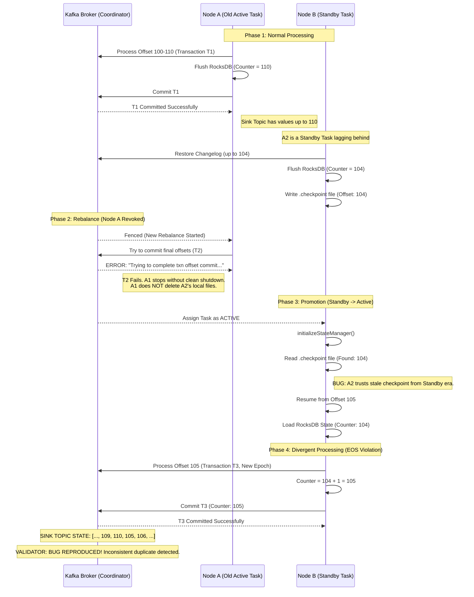

# Diagnostic Report: KAFKA-17507 (EOS Violation)

## Executive Summary
This report documents the reproduction and root cause analysis of **KAFKA-17507**, a critical bug in Kafka Streams (reproduced on version 3.5.1) where Exactly-Once Semantics (EOS) are violated during rebalancing. The bug leads to state store regressions where a task resumes processing from a stale offset using stale local state, committing divergent data that the broker accepts due to a fresh producer epoch.

---

## 1. Reproduction Environment
- **Kafka Version:** 3.5.1
- **Topology:** A simple `transform` application that increments a counter in a RocksDB state store and mirrors the result to a sink topic.
- **Chaos Strategy:**
    - Frequent rebalancing (sequential startup of 3 instances).
    - Network chaos (latency/loss) targeting the Transaction Coordinator.
    - `read_committed` consumer used for validation.

### Evidence of Failure
The `Validator` detected inconsistent duplicates in the sink topic despite the `read_committed` isolation level:
```text
[BUG REPRODUCED: INCONSISTENT DUPLICATE (Read Committed)] 
Partition: 17, Key: key_17, LastValue: 110, NewValue: 105
```
This shows the counter regressed from **110** to **105**, and the broker allowed the "new" (but stale) value to be committed.

---

## 2. Technical Root Cause Analysis
The failure occurs due to an "unconditional trust" in local `.checkpoint` files during task promotion from **Standby** to **Active**.

### A. Standby Checkpointing
In Kafka Streams, Standby tasks tail the changelog to stay warm. They periodically write a `.checkpoint` file to track their progress. These checkpoints are **non-transactional** and are not synchronized with the transactions of the Active task.

### B. Dirty Promotion
When a rebalance occurs, a Standby task may be promoted to **Active** on the same node.
- **File:** `ProcessorStateManager.java`
- **Logic:** The manager reads the existing `.checkpoint` file. If found, it sets the store offset to that value.
- **The Gap:** In EOS mode, the checkpoint file should ideally only be trusted if it was written during a clean shutdown of an Active task. However, the system cannot distinguish between a "Clean Active Checkpoint" and a "Lagging Standby Checkpoint".

### C. State Divergence
1. **Node A (Active)** commits Offset 110. RocksDB is at 110.
2. **Node B (Standby)** is at Offset 104. It writes a `.checkpoint` for 104.
3. **Rebalance** occurs. Node B is promoted to **Active** for the same task.
4. **Node B** loads the checkpoint (104) and resumes processing from 105.
5. **Node B** uses its local RocksDB (stale at 104).
6. **Result:** Node B produces `104 + 1 = 105` for offset 105. Since it has a new **Producer Epoch**, the broker accepts the write, overwriting the logical timeline.

---

## 3. Failure Chain (Sequence Diagram)



---

## 4. Broker-Side Analysis
The exception `Trying to complete a transactional offset commit for producerId ... even though the offset commit record itself hasn't been appended to the log` (found in `GroupMetadata.scala`) is a key symptom. It confirms that during the rebalance race, the **Group Coordinator** lost track of the pending offset commits, causing the "Old Active" task to fail its final commit. This failure prevents the clean deletion of stale files, directly enabling the "Dirty Promotion" on the next instance.

---

## 5. Mitigation and Fixes
- **KAFKA-17507 Fix:** Improve the handling of `TaskCorruptedException`. When EOS is enabled, the system should be more skeptical of local checkpoints. If a task is promoted from Standby to Active, it should verify the checkpoint against the broker-committed offsets.
- **Standby Management:** Standby tasks should not write persistent checkpoints that can be misinterpreted as "Stable Active State" unless they are guaranteed to be consistent with a `read_committed` view of the changelog.
