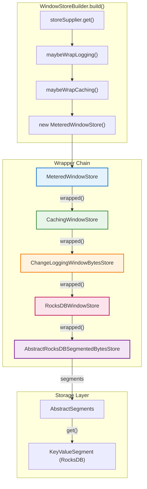
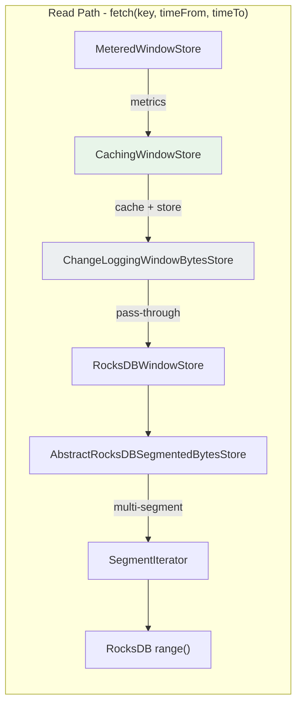
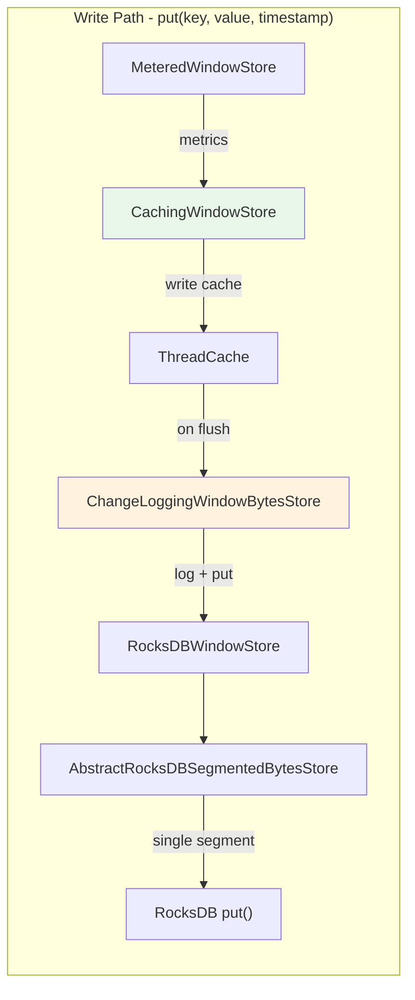
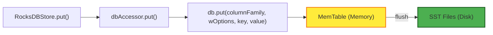
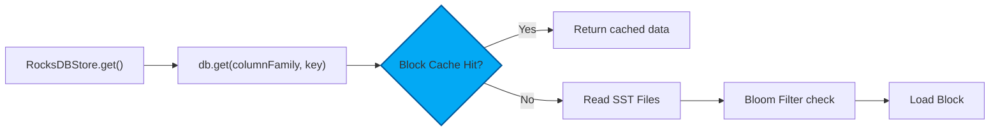
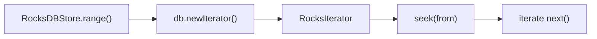

# Window Store Internals Supplement

> **Document Type**: Architecture Supplement  
> **Related Document**: [deduplication-window-store-design.md](./deduplication-window-store-design.md)  
> **Version**: 1.0  
> **Last Updated**: 2026-01-18

---

## 1. Overview

This document supplements `deduplication-window-store-design.md` with detailed analysis of Kafka Streams Window Store internal implementation, including:

- Wrapper Chain construction (Decorator Pattern)
- Complete Read Path and Write Path call chains
- RocksDB physical layer operations

All content has been verified against Kafka Streams 3.x source code.

---

## 2. Wrapper Chain Architecture

### 2.1 Design Pattern

Kafka Streams uses the **Decorator Pattern** to implement the layered Window Store architecture. All wrapper classes extend `WrappedStateStore`:

```java
// WrappedStateStore.java
public abstract class WrappedStateStore<S extends StateStore, K, V> {
    private final S wrapped;  // Inner store reference

    public WrappedStateStore(final S wrapped) {
        this.wrapped = wrapped;
    }

    public S wrapped() {
        return wrapped;  // Delegation entry point
    }
}
```

### 2.2 Wrapper Construction Chain



### 2.3 Source Code Locations

| Class | Source Path | Responsibility |
|-------|-------------|----------------|
| `MeteredWindowStore` | `state/internals/MeteredWindowStore.java` | Metrics recording |
| `CachingWindowStore` | `state/internals/CachingWindowStore.java` | In-memory caching |
| `ChangeLoggingWindowBytesStore` | `state/internals/ChangeLoggingWindowBytesStore.java` | Changelog logging |
| `RocksDBWindowStore` | `state/internals/RocksDBWindowStore.java` | Key schema conversion |
| `AbstractRocksDBSegmentedBytesStore` | `state/internals/AbstractRocksDBSegmentedBytesStore.java` | Segmented storage core |
| `AbstractSegments` | `state/internals/AbstractSegments.java` | Segment management |
| `KeyValueSegment` | `state/internals/KeyValueSegment.java` | RocksDB instance |

---

## 3. Read Path: fetch() Call Chain

### 3.1 Call Flow Diagram



### 3.2 Layer Behaviors

| Layer | Method | Behavior |
|-------|--------|----------|
| `MeteredWindowStore` | `fetch()` L229-241 | Records `fetchSensor` latency |
| `CachingWindowStore` | `fetch()` L196-221 | Query cache → query underlying → merge results |
| `ChangeLoggingWindowBytesStore` | `fetch()` L79-84 | Pure pass-through |
| `AbstractRocksDBSegmentedBytesStore` | `fetch()` L93-115 | Compute `actualFrom` → find segments → create iterator |

### 3.3 Core Logic

```java
// AbstractRocksDBSegmentedBytesStore.java L93-115
KeyValueIterator<Bytes, byte[]> fetch(Bytes key, long from, long to, boolean forward) {
    // Step 1: Compute effective start time
    final long actualFrom = Math.max(from, observedStreamTime - retentionPeriod + 1);
    
    // Step 2: Find relevant segments
    final List<S> searchSpace = keySchema.segmentsToSearch(segments, actualFrom, to, forward);
    
    // Step 3: Create binary key bounds
    final Bytes binaryFrom = keySchema.lowerRangeFixedSize(key, actualFrom);
    final Bytes binaryTo = keySchema.upperRangeFixedSize(key, to);
    
    // Step 4: Return cross-segment iterator
    return new SegmentIterator<>(searchSpace.iterator(), ..., binaryFrom, binaryTo, forward);
}
```

---

## 4. Write Path: put() Call Chain

### 4.1 Call Flow Diagram



### 4.2 Layer Behaviors

| Layer | Method | Behavior |
|-------|--------|----------|
| `MeteredWindowStore` | `put()` L194-210 | Records `putSensor` latency |
| `CachingWindowStore` | `put()` L155-176 | Writes to `ThreadCache` (deferred write) |
| `ChangeLoggingWindowBytesStore` | `put()` L132-139 | Write underlying + `context.logChange()` |
| `AbstractRocksDBSegmentedBytesStore` | `put()` L258-271 | `getOrCreateSegmentIfLive()` → `segment.put()` |

### 4.3 Core Logic

```java
// AbstractRocksDBSegmentedBytesStore.java L258-271
public void put(final Bytes key, final byte[] value) {
    final long timestamp = keySchema.segmentTimestamp(key);
    observedStreamTime = Math.max(observedStreamTime, timestamp);
    
    final long segmentId = segments.segmentId(timestamp);
    final S segment = segments.getOrCreateSegmentIfLive(segmentId, context, observedStreamTime);
    
    if (segment == null) {
        expiredRecordSensor.record(1.0d, ...);  // Record as expired
    } else {
        segment.put(key, value);  // Write to RocksDB
    }
}
```

---

## 5. RocksDB Physical Layer

### 5.1 Write Path



### 5.2 Read Path



### 5.3 Range Scan



### 5.4 Configuration Parameters

| Parameter | Value | Description |
|-----------|-------|-------------|
| `WRITE_BUFFER_SIZE` | 16 MB | MemTable size |
| `BLOCK_CACHE_SIZE` | 50 MB | Block cache size |
| `BLOCK_SIZE` | 4 KB | SST block size |
| `MAX_WRITE_BUFFERS` | 3 | Maximum MemTable count |
| `WAL` | ❌ Disabled | Relies on Kafka Changelog |
| `BloomFilter` | ✅ Enabled | Accelerates point queries |

> [!IMPORTANT]
> `wOptions.setDisableWAL(true)` - Kafka Streams disables RocksDB WAL, relying on Kafka Changelog Topic for durability and recovery.

### 5.5 Segment Directory Structure

```
state-dir/
└── rocksdb/
    └── {store-name}/
        ├── {store-name}.0           # timestamp / segmentInterval = 0
        ├── {store-name}.3600000     # segment 1 hour
        └── {store-name}.7200000     # segment 2 hours
```

Each segment is an independent RocksDB instance containing:
- `*.sst` - Sorted data files
- `CURRENT` - Current MANIFEST pointer
- `MANIFEST-*` - Metadata log
- `OPTIONS-*` - RocksDB config snapshot

---

## 6. Read vs Write Comparison

| Dimension | Read Path | Write Path |
|-----------|-----------|------------|
| **CachingWindowStore** | Check cache first, then underlying | Write to cache, flush later |
| **ChangeLoggingWindowBytesStore** | Pass-through | Write underlying + log changelog |
| **Segment Access** | May span multiple segments | Single segment only |
| **RocksDB Operation** | `get()` or `range()` | `put()` |
| **Time Complexity** | O(segments × log n) | O(log n) |

---

## 7. Source Code Reference

| File | Key Lines | Content |
|------|-----------|---------|
| `AbstractRocksDBSegmentedBytesStore.java` | L93-115 | `fetch()` implementation |
| `AbstractRocksDBSegmentedBytesStore.java` | L258-271 | `put()` implementation |
| `AbstractSegments.java` | L56-68 | `segmentId()`, `segmentName()` |
| `RocksDBStore.java` | L315-322 | `put()` JNI call |
| `RocksDBStore.java` | L396-404 | `get()` JNI call |
| `WindowStoreBuilder.java` | L56-63 | Wrapper construction chain |
